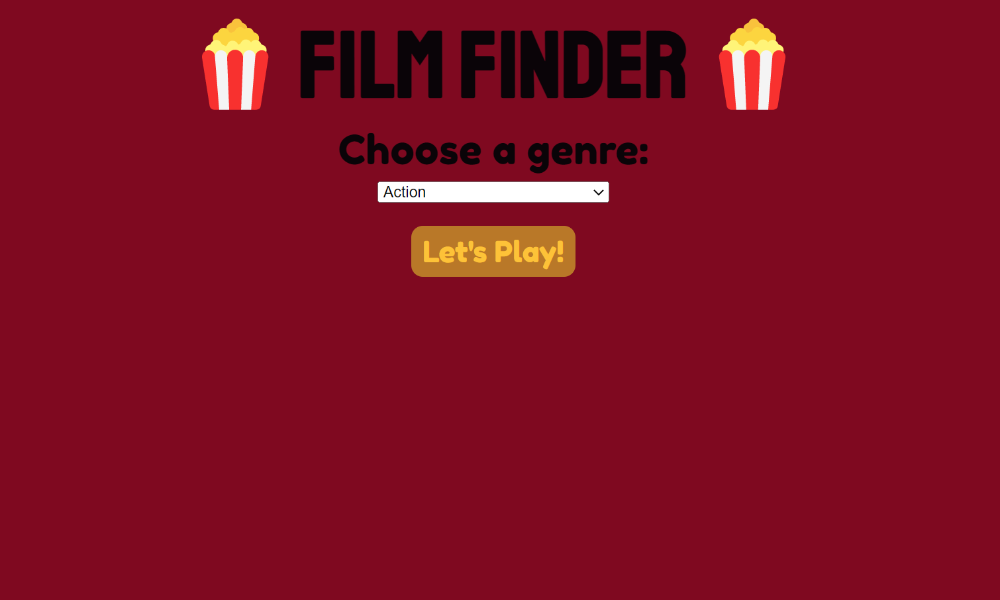

# Film Finder!
Welcome to FilmFinder! Looking to Netflix and Chill but out of suggestions to watch? Have no fear, Film Finder is Here! Film finder is a JavaScript projects that utilises my knowledge of HTTP requests and asynchronous JavaScript to create a movie discovery app that will recommend random movies by genre. You’ll be able to choose from several genres, and like or dislike a movie to get another suggestion.

## Getting Started
1. Run `git clone https://github.com/khalilgreenidge/FilmFinder.git` in your terminal.
2. Before you begin, you’ll need to create an account on [The Movie Database website](https://developers.themoviedb.org/3/getting-started/introduction). After you create your account and **verify** your email address, click on your user icon at the top right corner and navigate to the Settings page. On the Settings page, navigate to the `API` section and click on the link to `Request an API Key` to register as a Developer.
3. Save the API key you obtained from the **TMDB API** to the `tmdbKey` variable found in [script.js](public/script.js).
4. Sometimes, APIs change their endpoint often. If it does, you may need to change the `discover/movie`, `/genre/movie/list?` or `/movie/${movieId}` endpoints.
5. Run the `index.html` in your browser.
6. Have fun! 🍿

